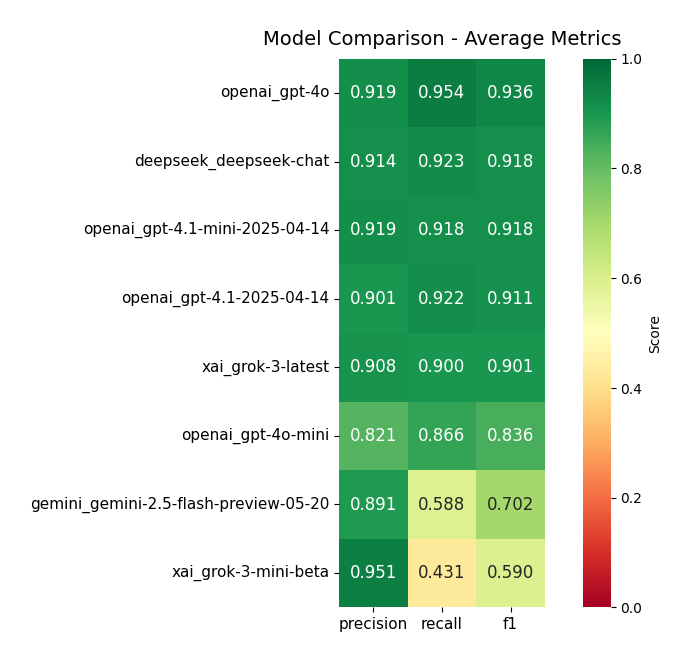
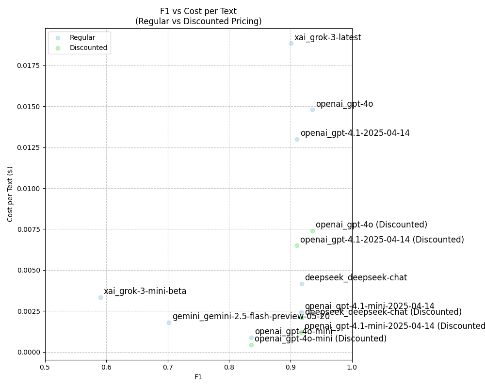
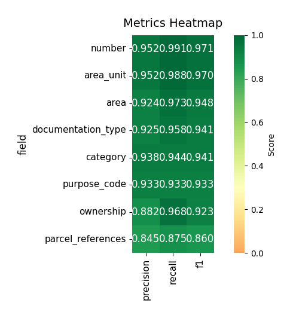

# PhD Extraction Research Workspace

## Folder Structure

- **results_for_evaluation/**
  - Contains the original `.txt` files. Each file represents a source document to be processed and evaluated. These are the primary data inputs for extraction and evaluation workflows.
  - For each `.txt` file, there may be:
    - A human-annotated `.json` file (e.g., `file_human.json`)
    - Model extraction `.json` files (e.g., `file_{model}.json`)
    - Model usage files (e.g., `file_{model}_usage.json`)

- **visualization_results/**
  - Contains CSV files and images generated from evaluation results for further analysis and visualization.

---

## Running Extraction with Model

To extract information from the source `.txt` files, use the `extract_with_model.py` script. This script reads each `.txt` file in the specified directory and produces corresponding `.json` files containing the extraction results. Additionally, for each extraction, a `_usage.json` file is generated to record the model's token usage statistics.

**Example usage:**

```sh
python3 ../extract_with_model.py ../results_for_evaluation/ --model gemini_gemini-2.5-flash-preview-05-20
```

- **Input:** `.txt` files in the target directory.
- **Output:** `.json` files with extraction results, and `_usage.json` files with token usage details for each model run.

### Example Input and Output Files

#### Example `.txt` file

```
ПОРЯДОК ДЕННИЙ
28 чергової сесії VIII скликання Вишевицької сільської ради
від 03.03.2023 року
1. Про звіт Вишевицького сільського голови «Про роботу Вишевицької сільської ради та її виконавчого комітету за 2022 рік»
Доповідач: сільський голова Сергій ГАВРУТЕНКО
2. Про затвердження звіту про виконання бюджету Вишевицької сільської територіальної громади за 2022 рік
Доповідач: начальник відділу фінансів – Олена КОСТЮК
...
```

#### Example output `.json` file

```json
[
  {
    "id": 0,
    "type": "parcel",
    "number": "6122687300:01:002:0091",
    "area": 0.3,
    "area_unit": "ha",
    "purpose_code": "01.03",
    "category": "Землі сільськогосподарського призначення",
    "ownership": "Приватна власність"
  },
  {
    "id": 0,
    "type": "documentation",
    "documentation_type": "LAND_PLOT_ALLOCATION_PROJECT",
    "involved_parcels": [
      0
    ]
  }
]
```

#### Example output `_usage.json` file

```json
{
  "openai/gpt-4o-mini": {
    "completion_tokens": 251,
    "prompt_tokens": 4385,
    "total_tokens": 4636,
    "completion_tokens_details": {
      "accepted_prediction_tokens": 0,
      "audio_tokens": 0,
      "reasoning_tokens": 0,
      "rejected_prediction_tokens": 0,
      "text_tokens": 0
    },
    "prompt_tokens_details": {
      "audio_tokens": 0,
      "cached_tokens": 1536,
      "text_tokens": 0,
      "image_tokens": 0
    }
  }
}
```

---

## Running Evaluation with Model

To evaluate the extraction results, use the `evaluate_extraction.py` script. This script compares the model's `.json` outputs with human-annotated `.json` files for each `.txt` file, calculates precision, recall, and F1 metrics for each field, and estimates the cost of model usage based on token counts.

**Example usage:**

```sh
python3 ../evaluate_extraction.py ../results_for_evaluation/ --model gemini_gemini-2.5-flash-preview-05-20
```

- The `--model` parameter should match the model name used in the output `.json` and `_usage.json` files.
- The script prints evaluation metrics and cost analysis, and saves results as CSV files.

**How it works:**
- For each `.txt` file, the script compares the model's extraction `.json` with the human-annotated `.json`.
- It computes precision, recall, and F1 for each field (e.g., `number`, `area`, `purpose_code`, etc.).
- It aggregates token usage and cost statistics from the `_usage.json` files.
- Results are saved as CSVs for further analysis and visualization.

---

## Creating Source Data for Visualization

To prepare the data for visualization, install the required Python packages and run the evaluation script as above.

**Install dependencies:**

```sh
python3 -m pip install tqdm pandas
```

**Run evaluation and generate visualization data:**

```sh
python3 ../evaluate_extraction.py ../results_for_evaluation/ --model gemini_gemini-2.5-flash-preview-05-20
```

This will process the evaluation results and create the necessary CSV data for visualization in the `visualization_results/` folder.

---

## Example Visualizations

Below are example images generated from the evaluation results (located in `visualization_results/`). These visualizations help compare model performance and cost.

**Model Comparison Heatmap (F1, Precision, Recall):**



**Cost vs F1 Score:**



**Field-level Metrics Heatmap (for a specific model):**



---

*Fill in the evaluation instructions above as needed for your workflow.*

